# Passo a passo: Integração do projeto **garh** com o SonarQube

Este guia descreve como:

1. Acessar o SonarQube corporativo.  
2. Criar o projeto **garh** no SonarQube.  
3. Gerar um token de análise.  
4. Executar a análise via Maven na sua máquina de desenvolvimento.  
5. (Opcional) Subir um SonarQube local via Docker para testes.

Todos os prints de tela estão na pasta [`images`](./images).

## 📑 Índice

- [1. Acessar o SonarQube](#1-acessar-o-sonarqube)
- [2. Criar o projeto no SonarQube](#2-criar-o-projeto-no-sonarqube)
  - [2.1. Iniciar criação de projeto](#21-iniciar-criação-de-projeto)
  - [2.2. Preencher dados do projeto](#22-preencher-dados-do-projeto)
  - [2.3. Definir baseline (Clean as You Code)](#23-definir-baseline-clean-as-you-code)
  - [2.4. Tela inicial do projeto criado](#24-tela-inicial-do-projeto-criado)
- [3. Gerar o token do projeto](#3-gerar-o-token-do-projeto)
- [4. Executar a análise com Maven](#4-executar-a-análise-com-maven)
  - [4.1. Estrutura do projeto](#41-estrutura-do-projeto)
  - [4.2. Ajustar o Maven para aceitar repositórios HTTP](#42-ajustar-o-maven-para-aceitar-repositórios-http)
  - [4.3. Executar o comando Maven](#43-executar-o-comando-maven)
- [5. Maven Toolchains – projetos com versões de java inferiores a 55.0 (Java 11)](#5-maven-toolchains---projetos-com-versões-de-java-inferiores-a-550-java-11)
  - [5.1. Volte o Maven para Java 21 (ou 17)](#51-volte-o-maven-para-java-21-ou-17)
  - [5.2. Configure o Toolchain para forçar o javac 1.8 só na compilação](#52-configure-o-toolchain-para-forçar-o-javac-18-só-na-compilação)
    - [5.2.1. Criar toolchains.xml](#521-crie-cusersuserm2toolchainsxml)
    - [5.2.2. Ajustar o pom.xml](#522-no-pomxml-do-projetopai-adicione)
  - [5.3. Rodar o Sonar normalmente (com Java 21)](#53-rode-o-sonar-normalmente-com-java-21)
- [6. (Opcional) Subir um SonarQube local via Docker](#6-opcional-subir-um-sonarqube-local-via-docker)


---

## 1. Acessar o SonarQube

1. Abra o navegador e acesse o SonarQube corporativo:

```text
   https://sonarcelepar.globalhitss.com.br
````

2. Informe seu usuário de rede e senha.

   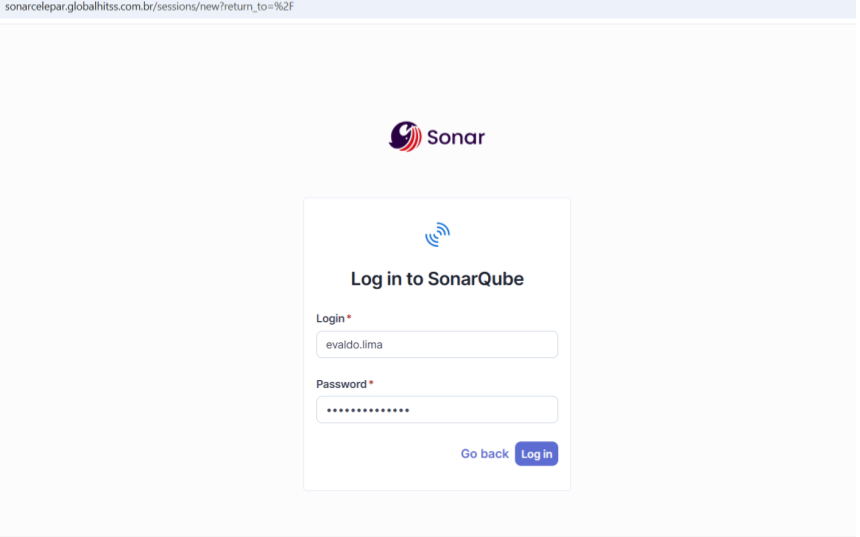

3. Clique em **Log in**.

---

## 2. Criar o projeto no SonarQube

### 2.1. Iniciar criação de projeto

1. Após o login, acesse o menu **Projects**.
2. Clique em **Create Project**.
3. Na tela **How do you want to create your project?**, escolha **Create a local project**.

   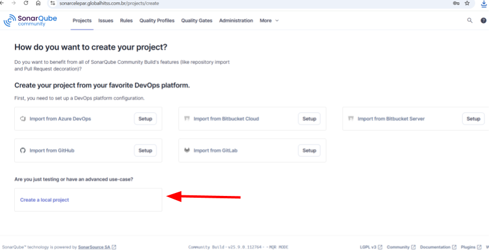

### 2.2. Preencher dados do projeto

Na tela **Create a local project** (1 de 2), preencha:

* **Project display name***: `garh`
* **Project key***: `br.gov.pr.celepar:garh`
* **Main branch name***: `master`

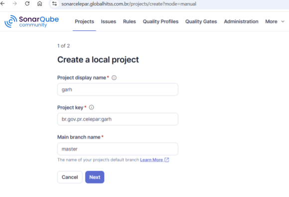

Clique em **Next**.

### 2.3. Definir baseline (Clean as You Code)

Na tela **Set up project for Clean as You Code** (2 de 2), mantenha a opção padrão:

* **Use the global setting**

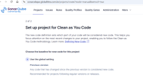

Se for necessário configurar uma baseline específica (por data, branch de referência, etc.), utilize as opções avançadas exibidas na parte inferior da tela:

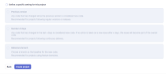

Clique em **Create project**.

### 2.4. Tela inicial do projeto criado

Ao finalizar, você será direcionado à tela do projeto **garh**, na aba de **Analysis Method**.

Nela, selecione o método de análise **Locally**, que é o que será utilizado neste passo a passo.

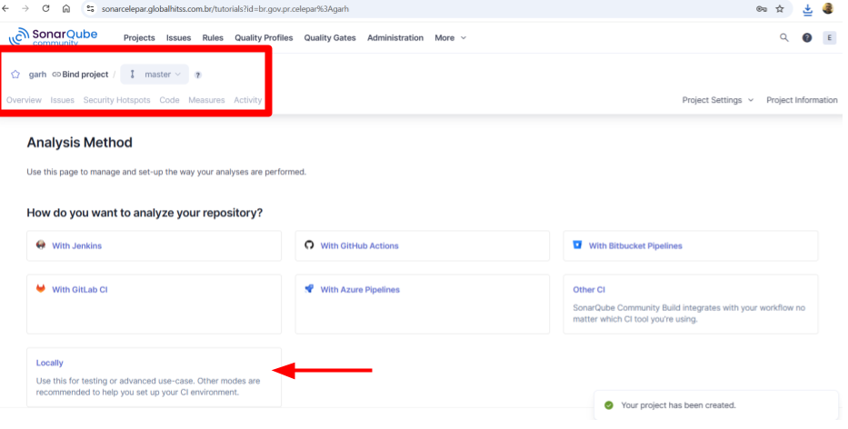

---

## 3. Gerar o token do projeto

Na tela de configuração da análise local:

1. Em **Analyze your project**, localize a seção **Provide a token**.

2. Escolha **Generate a project token**.

   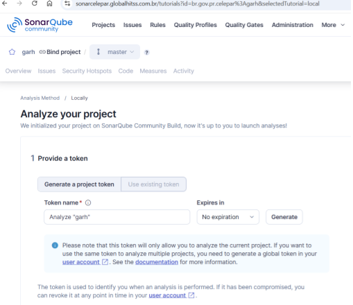

3. Preencha os dados:

   * **Token name***: `Analyze "garh"`
   * **Expires in**: `No expiration`

4. Clique em **Generate**.

5. O SonarQube exibirá o token gerado:

   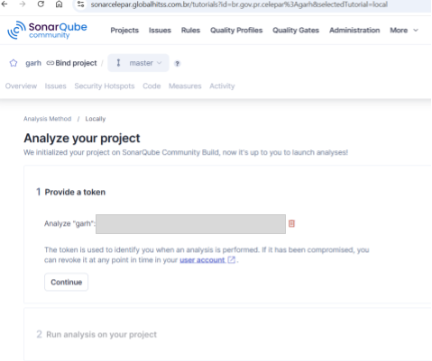

6. **Copie e guarde este token** com segurança — ele será utilizado no comando Maven.

7. Clique em **Continue** para avançar para a etapa de configuração do comando.

Na próxima tela, o SonarQube mostrará um comando Maven de exemplo contendo o token gerado:

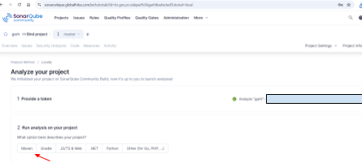

> **Atenção:** o token **não será mostrado novamente**. Caso seja perdido, será necessário gerar um novo token.

---

## 4. Executar a análise com Maven

### 4.1. Estrutura do projeto

No workspace local, o projeto **garh** utiliza a estrutura padrão Maven:

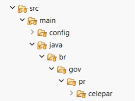

Exemplo de caminho:

```text
D:\Documentos\HITSS\garh
 └─ src
    └─ main
       └─ java
          └─ br
             └─ gov
                └─ pr
                   └─ celepar
```

### 4.2. Ajustar o Maven para aceitar repositórios HTTP 
### (somente se for executar docker local)

> Este ajuste não é necessário porque o Maven, por padrão, bloqueia repositórios HTTP (não HTTPS).
> Como o repositório interno da CELEPAR utiliza HTTPS, não é preciso liberar esse acesso. Somente se for utilizar a opção 5.

1. Descubra o caminho do Maven instalado:

   ```cmd
   where mvn
   ```

   Exemplo de saída:

   ```text
   C:\Program Files\apache-maven-3.9.8\bin\mvn
   ```

2. Abra o arquivo de configuração **global** do Maven:

   ```text
   C:\Program Files\apache-maven-3.9.8\conf\settings.xml
   ```

3. Localize o bloco abaixo:

   ```xml
   <mirror>
     <id>maven-default-http-blocker</id>
     <mirrorOf>external:http:*</mirrorOf>
     <name>Pseudo repository to mirror external repositories initially using HTTP.</name>
     <url>http://0.0.0.0/</url>
   </mirror>
   ```

4. Comente ou remova esse bloco `<mirror>...</mirror>`.

5. Salve o arquivo.

6. Feche todos os terminais abertos.

7. Abra **um novo Prompt de Comando** (não use PowerShell para este passo a passo).

---

### 4.3. Executar o comando Maven

> ⚠️ **Importante (Windows / PowerShell):**
> No PowerShell o caractere de continuação de linha **NÃO é `^`**.
> O correto é usar a **crase ( ` )** no final de cada linha.

---

1. No **Windows PowerShell**, navegue até a pasta raiz do projeto:

   ```powershell
   D:
   cd D:\Documentos\HITSS\garh
   ```

2. Utilize o comando Maven sugerido pelo próprio SonarQube, ajustando o token e a URL do servidor conforme o ambiente corporativo. **Lembrando que o sonar não roda no JAVA 11, por isso a necessidade de modificação do JAVA_HOME temporariamente no SHELL**:

```powershell
$env:JAVA_HOME = "C:\Program Files\Java\jdk-21"
$env:Path = "$env:JAVA_HOME\bin;$env:Path"

mvn clean verify sonar:sonar `
  "-Dsonar.projectKey=br.gov.pr.celepar:garh" `
  "-Dsonar.projectName=garh" `
  "-Dsonar.host.url=https://sonarcelepar.globalhitss.com.br" `
  "-Dsonar.token=sqp_SEU_TOKEN_AQUI" `
  "-Dsonar.scanner.force-deprecated-java-version=true"

   ```

   

3. A execução pode levar alguns minutos, dependendo do tamanho do projeto.

   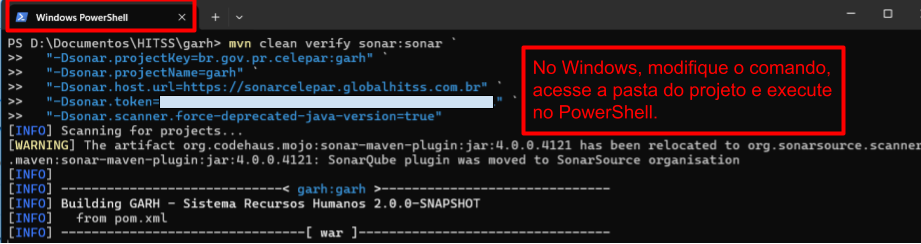

4. Ao final, o Maven exibirá o **tempo total** da análise e uma URL com o resultado no SonarQube:

   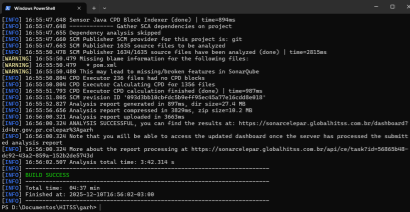

5. Acesse a URL informada no fim do log ou, alternativamente, entre no SonarQube em:

   ```text
   https://sonarcelepar.globalhitss.com.br/projects
   ```

   Abra o projeto **garh** e verifique o painel com os resultados da análise:

   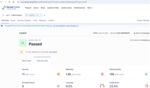


---
## 5. **Maven Toolchains** - projetos com versões de java inferiores a 55.0 (Java 11).
### 5.1) Volte o Maven para Java 21 (ou 17)

```powershell
$env:JAVA_HOME = "C:\Program Files\Java\jdk-21"
$env:Path = "$env:JAVA_HOME\bin;$env:Path"

mvn -v
```

Tem que mostrar Java 21.

---

### 5.2) Configure o Toolchain para forçar o **javac 1.8** só na compilação

#### 5.2.1 Crie: `C:\Users\User\.m2\toolchains.xml`

(ajuste o caminho real do seu JDK 8)

```xml
<?xml version="1.0" encoding="UTF-8"?>
<toolchains>
  <toolchain>
    <type>jdk</type>
    <provides>
      <version>1.8</version>
    </provides>
    <configuration>
      <jdkHome>C:\Program Files\Java\jdk-1.8</jdkHome>
    </configuration>
  </toolchain>
</toolchains>
```

#### 5.2.2 No `pom.xml` (do projeto/pai), adicione:

```xml
<build>
  <plugins>
    <plugin>
      <groupId>org.apache.maven.plugins</groupId>
      <artifactId>maven-toolchains-plugin</artifactId>
      <version>3.1.0</version>
      <executions>
        <execution>
          <goals>
            <goal>toolchain</goal>
          </goals>
        </execution>
      </executions>
      <configuration>
        <toolchains>
          <jdk>
            <version>1.8</version>
          </jdk>
        </toolchains>
      </configuration>
    </plugin>
  </plugins>
</build>
```

---

### 5.3) Rode o Sonar normalmente (com Java 21)

```powershell
mvn clean verify sonar:sonar `
  -Dsonar.projectKey=br.gov.pr.celepar:src `
  -Dsonar.projectName=src `
  -Dsonar.host.url=https://sonarcelepar.globalhitss.com.br `
  -Dsonar.token=TOKEN
```

✅ Assim:

* O **SonarQubeMojo** roda em Java 21 (não dá UnsupportedClassVersionError)
* O **compile** usa JDK 8 via toolchain (não dá `javax.jws does not exist`)

---

## 6. (Opcional) Subir um SonarQube local via Docker

Caso seja necessário realizar testes em um ambiente **local** (por exemplo, fora da rede corporativa), é possível subir um SonarQube em Docker:

```yaml
version: "3.8"

services:
  sonarqube-db:
    image: postgres:14-alpine
    container_name: sonarqube-db
    restart: unless-stopped
    environment:
      POSTGRES_USER: sonar
      POSTGRES_PASSWORD: sonar
      POSTGRES_DB: sonarqube
    volumes:
      - postgresql_data:/var/lib/postgresql/data
    networks:
      - sonarnet

  sonarqube:
    image: sonarqube:latest
    container_name: sonarqube
    restart: unless-stopped
    ports:
      - "9000:9000"
    environment:
      SONAR_JDBC_URL: jdbc:postgresql://sonarqube-db:5432/sonarqube
      SONAR_JDBC_USERNAME: sonar
      SONAR_JDBC_PASSWORD: sonar
      SONAR_ES_BOOTSTRAP_CHECKS_DISABLE: "true"
    volumes:
      - sonarqube_data:/opt/sonarqube/data
      - sonarqube_logs:/opt/sonarqube/logs
      - sonarqube_extensions:/opt/sonarqube/extensions
    networks:
      - sonarnet
    depends_on:
      - sonarqube-db

volumes:
  postgresql_data:
  sonarqube_data:
  sonarqube_logs:
  sonarqube_extensions:

networks:
  sonarnet:
    driver: bridge
```

Suba o ambiente com:

```cmd
docker compose up -d
```

Nesse caso, ajuste o comando Maven para apontar para o SonarQube local:

```cmd
-Dsonar.host.url=http://localhost:9000
```

---

Com isso, o projeto **garh** estará integrado ao SonarQube, permitindo o acompanhamento contínuo de qualidade de código, bugs, vulnerabilidades e code smells.

```
```
