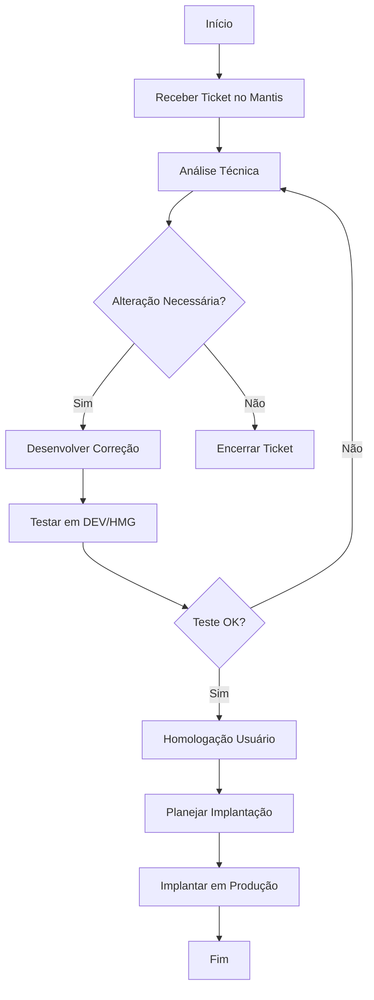

# 🔀 Diagrama de Fluxo – Processo / Regra de Negócio
**Sistema:**  
**Módulo:**  
**Ticket Mantis:**  
**Data:**  
**Responsável:**  

---

## 1. Objetivo do Fluxo
Explique qual processo ou regra está sendo representado (ex.: fluxo de atendimento, cálculo de valor, integração etc.).

---

## 2. Diagrama (Mermaid)

Altere o diagrama conforme o fluxo específico da demanda.

---

## 3. Descrição do Fluxo
Descreva os principais passos, decisões e caminhos alternativos.

---

## 4. Pontos Críticos / Riscos
- Regras sensíveis:  
- Dependências críticas:  
- Integrações envolvidas:  

---

## 5. Observações Finais
